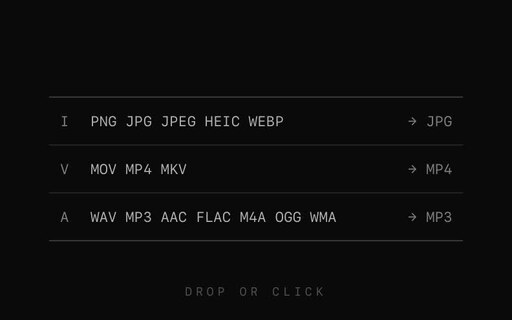
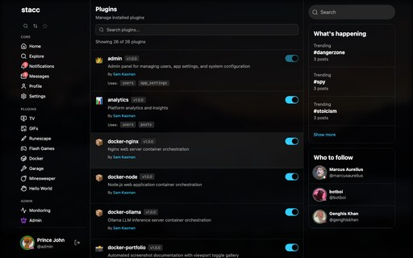
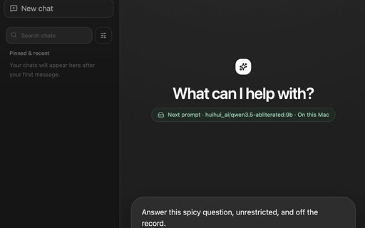
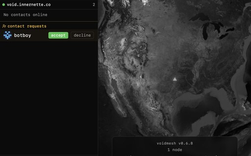
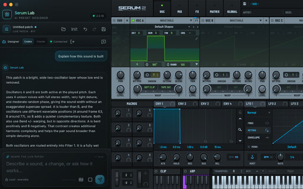
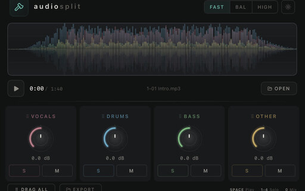
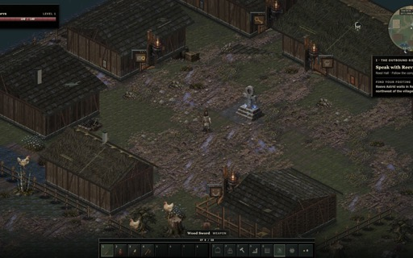

```
      ::::::::     :::      :::   :::  :::    :::
    :+:    :+:  :+: :+:   :+:+: :+:+: :+:   :::
   +:+        +:+   +:+ +:+ +:+:+ +:++:+  +:+
  +#++:++#+++#++:++#++:+#+  +:+  +#++#++:++
        +#++#+     +#++#+       +#++#+  +#+
#+#    #+##+#     #+##+#       #+##+#   #+#
######## ###     ######       ######    ###
```

I'm a Senior Software Engineer focused on turning ambitious ideas into polished web, mobile, and desktop products. [`TypeScript`](https://www.typescriptlang.org/) and [`React`](https://react.dev/) anchor my UI work, while [`Node.js`](https://nodejs.org/) powers development tooling and services. When a product needs native capabilities, deeper system access, or tighter performance, I reach for [`Rust`](https://www.rust-lang.org/), [`Tauri`](https://tauri.app/), [`C++`](https://isocpp.org/), or [`JUCE`](https://juce.com/).

I work remotely from my home on a lake in Texas for a large NYC-based company with a portfolio of direct-to-consumer brands, building headless commerce systems with [`TypeScript`](https://www.typescriptlang.org/), [`React Router`](https://reactrouter.com/), and [`Shopify`](https://shopify.dev/docs/storefronts/headless).

Technology, music, and motor vehicles are my passions. In software, those interests draw me to local and cloud AI, music and media tooling, private peer-to-peer systems, and thoughtfully designed local-first products.

## Projects

### Shipped

<table>
  <tr>
    <td width="272" valign="middle">
      <a href="./assets/projects/full/kompress.jpg"></a>
    </td>
    <td valign="middle">
      <strong><a href="https://github.com/samkasman/kompress">kompress</a></strong><br>
      A fast, cross-platform desktop app for compressing images, video, and audio through a minimal drag-and-drop interface with format-specific quality controls.
    </td>
  </tr>
</table>

### Works in progress

<table>
  <tr>
    <td width="272" valign="middle">
      <a href="./assets/projects/full/stacc.png"></a>
    </td>
    <td valign="middle">
      <strong><a href="https://github.com/samkasman/stacc">stacc</a></strong><br>
      A modular, AI-optimized full-stack platform for rapidly shipping production apps. It combines <a href="https://react.dev/reference/react-dom/server"><code>SSR</code></a>-first <a href="https://react.dev/"><code>React</code></a>, type-safe data, an extensible plugin system, built-in operations tooling, and <a href="https://tauri.app/"><code>Tauri</code></a>-powered apps across <a href="https://en.wikipedia.org/wiki/MacOS"><code>macOS</code></a>, <a href="https://en.wikipedia.org/wiki/Linux"><code>Linux</code></a>, <a href="https://en.wikipedia.org/wiki/Microsoft_Windows"><code>Windows</code></a>, <a href="https://en.wikipedia.org/wiki/IOS"><code>iOS</code></a>, and <a href="https://en.wikipedia.org/wiki/Android_(operating_system)"><code>Android</code></a>. Included plugins span analytics, communities, direct messaging, social feeds, achievements, documentation, monitoring, <a href="https://www.docker.com/"><code>Docker</code></a> orchestration and blue-green <a href="https://en.wikipedia.org/wiki/CI/CD"><code>CI/CD</code></a>, <a href="https://stripe.com/"><code>Stripe</code></a> payments, <a href="https://www.printful.com/"><code>Printful</code></a> commerce, vehicle maintenance, household planning, media libraries, and games.
    </td>
  </tr>
</table>

<table>
  <tr>
    <td width="272" valign="middle">
      <a href="./assets/projects/full/chatllm.jpg"></a>
    </td>
    <td valign="middle">
      <strong><a href="https://github.com/samkasman/chatLLM">chatLLM</a></strong><br>
      A native <a href="https://en.wikipedia.org/wiki/MacOS"><code>macOS</code></a> app that brings private on-device models and frontier cloud AI into one conversation layer, with local model management, streaming responses, search, drafts, and clear provider provenance.
    </td>
  </tr>
</table>

<table>
  <tr>
    <td width="272" valign="middle">
      <a href="./assets/projects/full/voidmesh.png"></a>
    </td>
    <td valign="middle">
      <strong><a href="https://github.com/samkasman/voidmesh">voidmesh</a></strong><br>
      Private, end-to-end-encrypted peer-to-peer messaging for text, files, and calls. Identity and conversation data stay on your devices, while federated discovery nodes connect peers without access to their traffic.
    </td>
  </tr>
</table>

<table>
  <tr>
    <td width="272" valign="middle">
      <a href="./assets/projects/full/serum-lab.jpg"></a>
    </td>
    <td valign="middle">
      <strong><a href="https://github.com/samkasman/serum-lab">serum-lab</a></strong><br>
      A <a href="https://en.wikipedia.org/wiki/MacOS"><code>macOS</code></a> workspace that embeds <a href="https://xferrecords.com/products/serum-2"><code>Serum 2</code></a> beside an AI chat panel. Design, audition, refine, explain, and save presets through natural language while keeping every change validated and reversible.
    </td>
  </tr>
</table>

<table>
  <tr>
    <td width="272" valign="middle">
      <a href="./assets/projects/full/audio-split.jpg"></a>
    </td>
    <td valign="middle">
      <strong><a href="https://github.com/samkasman/audio-split">audio-split</a></strong><br>
      AI stem separation that runs locally inside a <a href="https://en.wikipedia.org/wiki/Digital_audio_workstation"><code>DAW</code></a> or as a standalone app. Split tracks into vocals, drums, bass, and other stems, then mix, solo, mute, and export without uploading audio.
    </td>
  </tr>
</table>

<table>
  <tr>
    <td width="272" valign="middle">
      <a href="./assets/projects/full/suncross.jpg"></a>
    </td>
    <td valign="middle">
      <strong><a href="https://github.com/samkasman/suncross">suncross</a></strong><br>
      An isometric dark-medieval <a href="https://en.wikipedia.org/wiki/Massively_multiplayer_online_game"><code>MMO</code></a> with a server-authoritative shared world, persistent characters, skill-based leveling, combat, crafting, exploration, and a complete solo-playable journey.
    </td>
  </tr>
</table>
